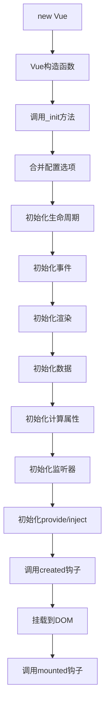
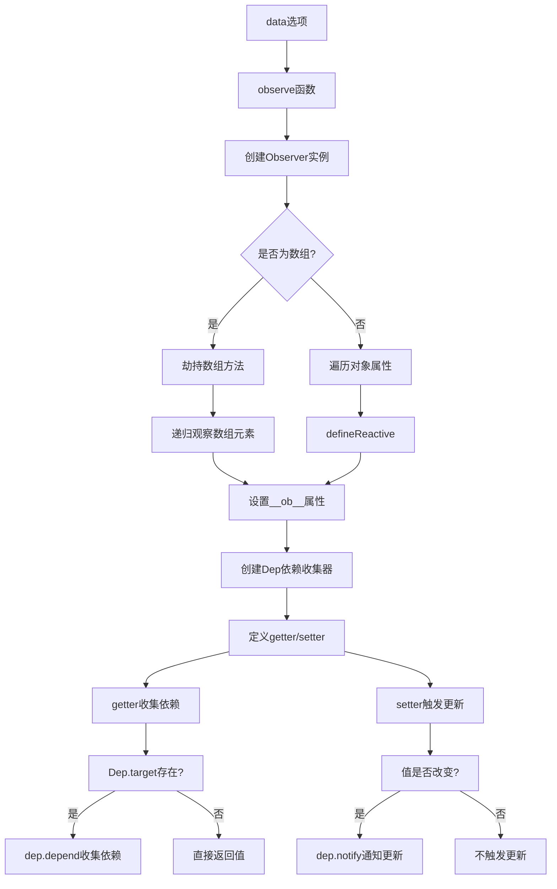
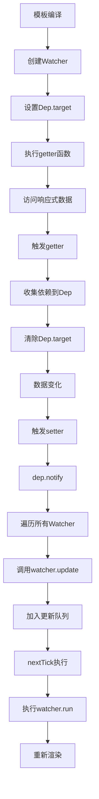
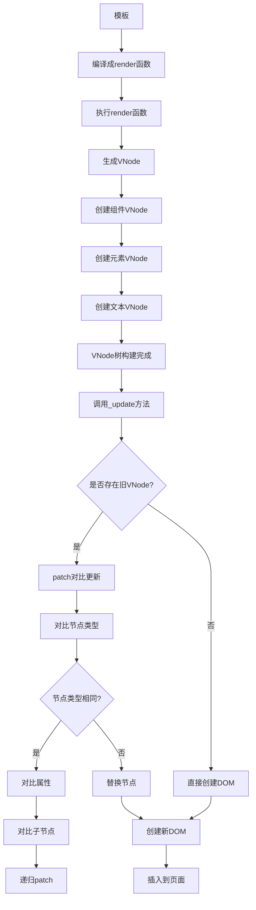
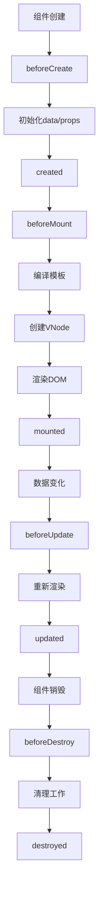
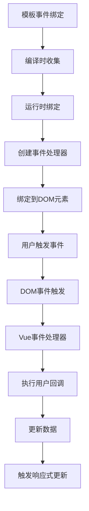
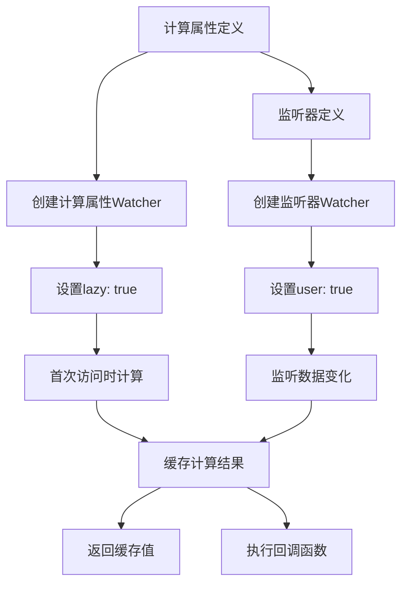
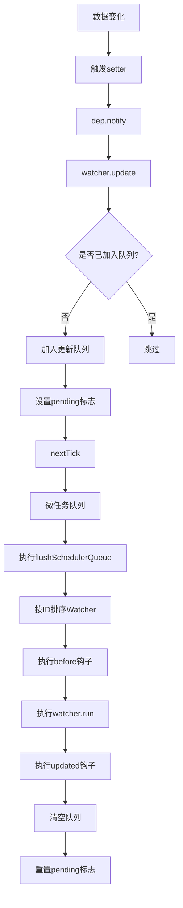
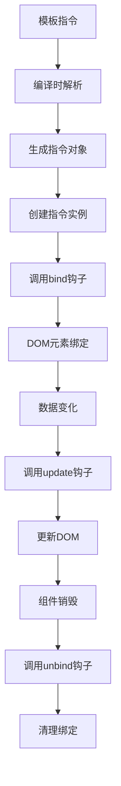
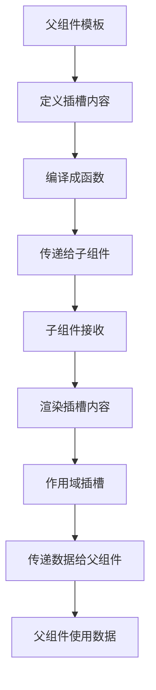

### 看源码的技巧

1. 听 B站 课程

2. 使用 AI 画出流程图

3. 使用 AI 添加一些中文注释

## Vue2 完整流程图

### 1. **Vue实例初始化流程**

### 2. **响应式系统流程**

### 3. **依赖收集和更新流程**

### 4. **虚拟DOM渲染流程**

### 5. **组件生命周期流程**

### 6. **事件系统流程**

### 7. **计算属性和监听器流程**

### 8. **异步更新队列流程**

### 9. **指令系统流程**

### 10. **插槽系统流程**

## 关键流程说明

### **初始化阶段**
1. **构造函数**：`new Vue()` 调用 `_init` 方法
2. **选项合并**：合并用户选项和默认选项
3. **生命周期初始化**：设置各种钩子函数
4. **数据初始化**：调用 `initData` 开始响应式处理

### **响应式阶段**
1. **observe**：为数据创建观察者
2. **defineReactive**：定义getter/setter
3. **依赖收集**：在getter中收集依赖
4. **更新触发**：在setter中触发更新

### **渲染阶段**
1. **模板编译**：将模板编译成render函数
2. **VNode创建**：执行render函数生成虚拟节点
3. **DOM更新**：通过patch算法更新真实DOM

### **更新阶段**
1. **数据变化**：触发setter
2. **依赖通知**：通知所有相关Watcher
3. **队列管理**：将更新任务加入队列
4. **异步执行**：在下一个tick中执行更新

这个流程图展示了Vue2从初始化到渲染的完整生命周期，每个阶段都有明确的职责和流程。理解这些流程有助于更好地掌握Vue2的工作原理！

